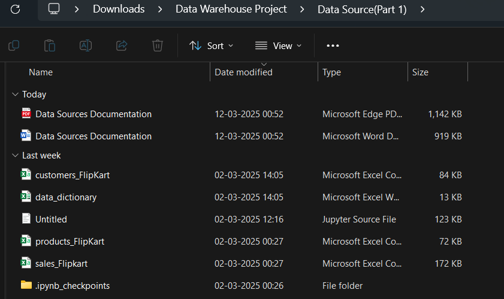
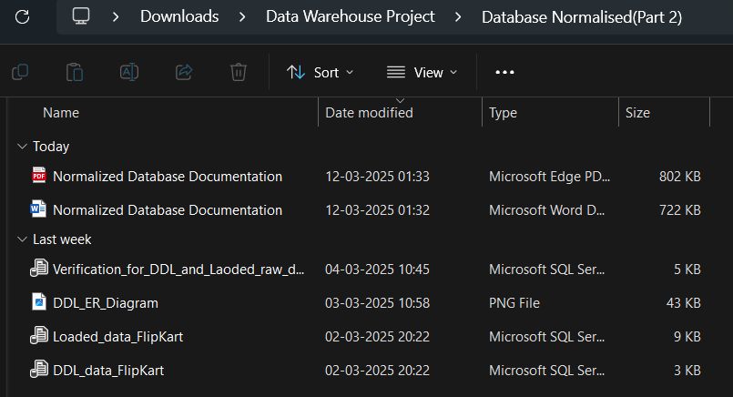
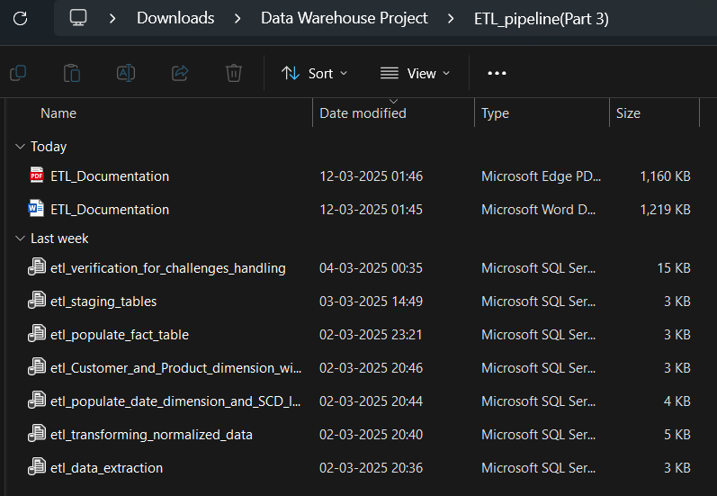
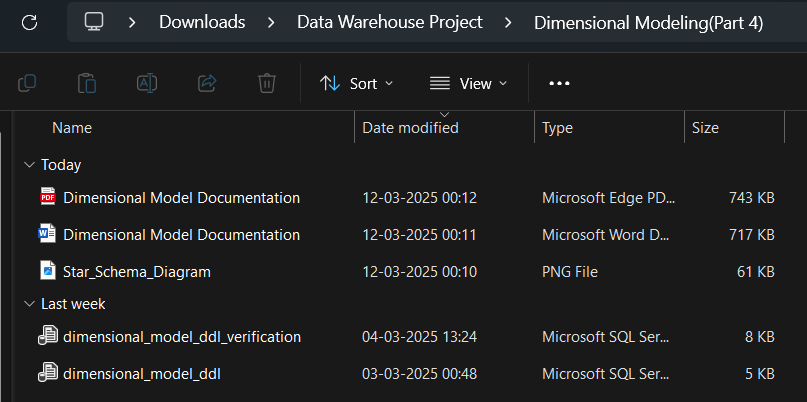
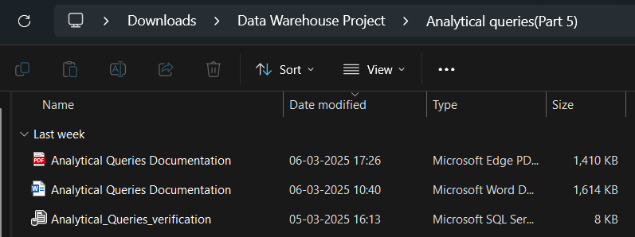
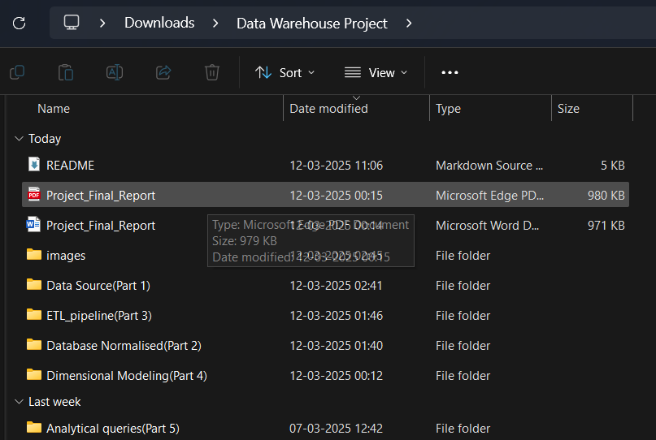
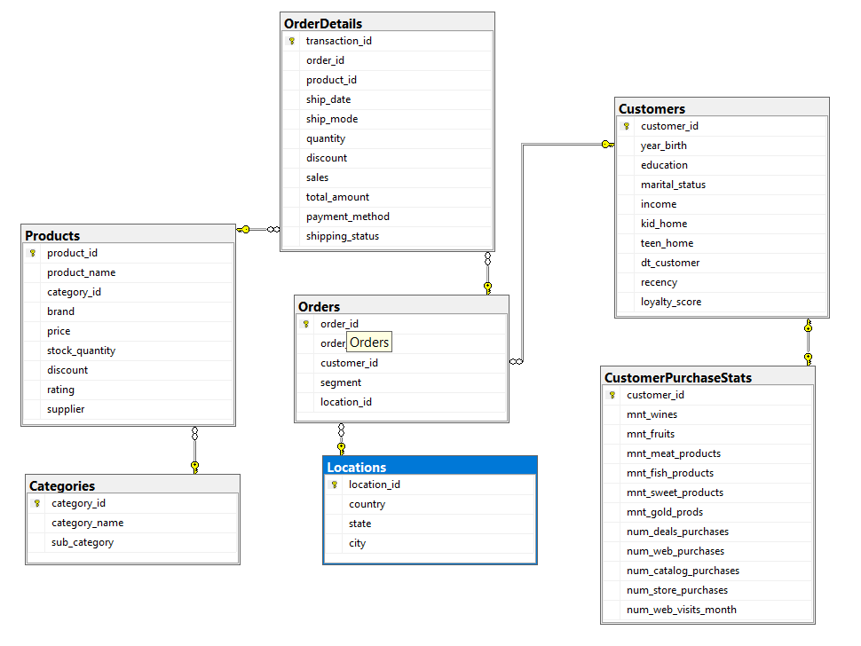
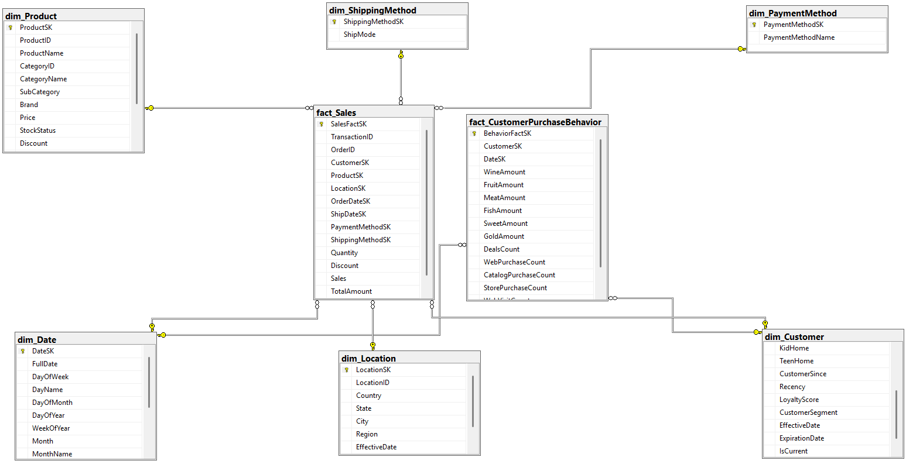

                                                                 Flipkart Data Warehouse Project

1. PROJECT OVERVIEW:

This project sets up a full data warehouse for an e-commerce site called FlipKart. It shows how to use ETL methods, dimensional modeling, and analytical querying. The application changes the raw data into a star schema that is best for reporting and analyzing business intelligence.

2. PROJECT STRUCTURE:

The project is organized into five main components, each in its own folder:

Data Warehouse Project/
├── Data Source(Part 1)/              # Raw data files and source documentation
├── Database Normalised(Part 2)/      # Normalized database implementation
├── ETL_pipeline(Part 3)/             # ETL process documentation and scripts
├── Dimensional Modeling(Part 4)/     # Dimensional model implementation
├── Analytical queries(Part 5)/       # Analytical queries and visualizations
└── Project_Final_Report              # Comprehensive summary of the entire project

3. COMPONENT DETAILS:

a. Data Source (Part 1)

Contains CSV files: Customers_FlipKart.csv, Products_FlipKart.csv, and Sales_FlipKart.csv
Includes data sources documentation explaining the datasets and their relationships
Data dictionary with explanations of all fields

b. Database Normalised (Part 2)

SQL DDL scripts for creating the normalized database schema
ER diagram showing the normalized structure
Documentation of the normalization process
Scripts for loading raw data into normalized tables

c. ETL Pipeline (Part 3)

Complete ETL scripts for extraction, transformation, and loading
Documentation of ETL challenges and solutions
Verification scripts for data quality checks
Logs showing successful ETL execution

d. Dimensional Modeling (Part 4)

SQL DDL scripts for creating the dimensional model
Star schema diagram
Documentation explaining dimension and fact table designs
Details on SCD Type 2 implementation and derived attributes

e. Analytical Queries (Part 5)

SQL scripts for various analytical queries
Visualization files
Documentation explaining business insights derived from queries

4. DATA WAREHOUSE PLATFORM AND TOOLS USED:

Data Warehouse Platform: Microsoft SQL Server
ETL Tool: SQL Server T-SQL
Visualization: Excel, Power BI (for query result visualizations), jupyter notebook

5. SETUP INSTRUCTIONS:

Prerequisites

i. Microsoft SQL Server 2019 or later
ii. SQL Server Management Studio (SSMS)
iii. ~5GB of free disk space

6. DATABASE SETUP:

a. Create Databases:

--sql

CREATE DATABASE DB_FlipKart;    -- For normalized database
CREATE DATABASE FlipKart_EDW;   -- For dimensional model (Enterprise Data Warehouse)

b. Set Up Normalized Database:

Open SSMS and connect to your SQL Server instance
Navigate to the "Database Normalised(Part 2)" folder
Execute the DDL script "DDL_data_flipKart.sql" to create the normalized tables
Execute the data loading script "Loaded_data_FlipKart.sql" to populate the normalized tables
Verify the setup with "Verification_for_DDL_and_Laoded_raw_data.sql"

c. Set Up ETL Process:

Navigate to the "ETL_pipeline(Part 3)" folder

Execute the ETL scripts in the following order:

"etl_staging_tables.sql" - Creates staging tables
"etl_data_extraction.sql" - Extracts data from normalized database
"etl_transforming_normalized_data.sql" - Transforms the extracted data
"etl_populate_date_dimension_and_SCD_1_2.sql" - Creates and populates date dimension
"etl_Customer_and_Product_dimension_with_SCD.sql" - Handles SCD Type 2 for dimensions
"etl_populate_fact_table.sql" - Populates the fact tables
"etl_verification_for_challenges_handling.sql" - Verifies ETL process

d. Set Up Dimensional Model:

Navigate to the "Dimensional Modeling(Part 4)" folder
Execute "dimensional_model_ddl.sql" to create the dimensional model (dimensions and fact tables)
Verify the setup with "dimensional_model_ddl_verification.sql"

e. Execute Analytical Queries:

Navigate to the "Analytical queries(Part 5)" folder
Execute "Analytical_Queries_verification.sql" to run the analytical queries and explore the data
Review the Analytical Queries Documentation which contains detailed explanations of each query and the business insights derived

7. SCREENSHOTS

### Project Structure

### Normalized Database ER Diagram

### Dimensional Model Star Schema

8. FUTURE ENHANCEMENTS:

Potential improvements for the future:

Enhanced customer segmentation using advanced algorithms
Real-time data integration
Expanded product hierarchy and attributes
Geographic expansion and enhancement
Automated data quality monitoring

"# Data-Warehouse-Project" 
